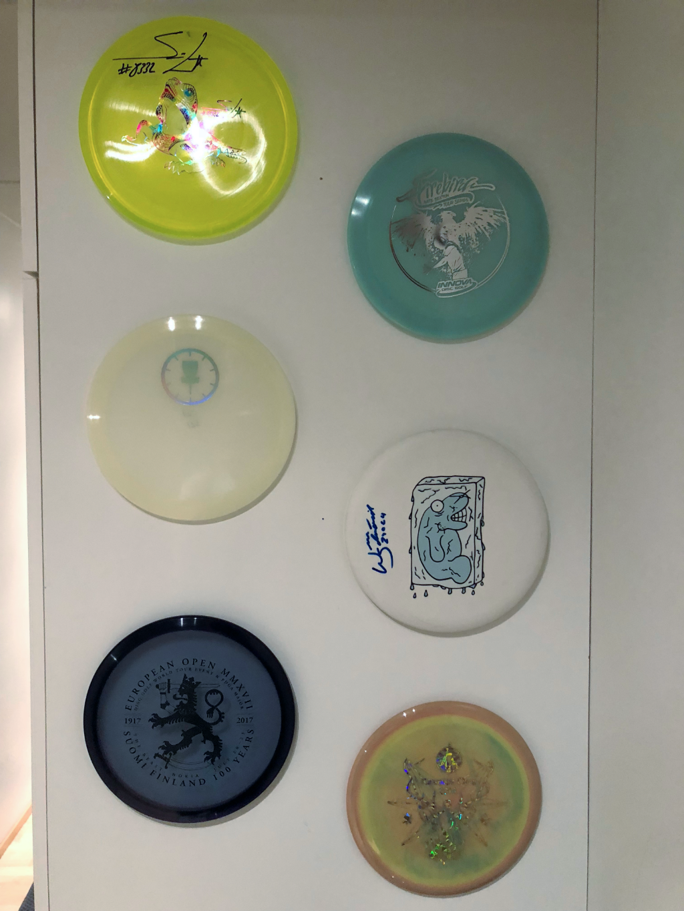

## For the love of the beautiful game

I've been playing disc golf since summer of 2011\. Simply put, disc golf is similar to (ball) golf with the minor exception that instead of trying to hit the ball in a small hole with your irons, you try to throw a plastic disc into a basket.

Nothing (well almost nothing) beats the feeling you get when you're out on a disc golf field on a beautiful and warm summer day, watching your discs fly way off the intended flight path, straight into a pond or a dense thorn bush. When you get better, you get the very same feeling, but without those ponds and bushes...

If I have a day off, I'll most likely wake up before sunrise and throw discs until I no longer can see the disc. I live and breathe disc golf.

I've been increasingly passionate about the beautiful game and everything around it. From playing to watching LIVE competition broadcasts, from collecting discs to dyeing them.

## Collecting plastics

They say you can play the game with only three discs (one putter, one midrange and one driver), maybe with even less. Bollocks, I say. You need more of them, a lot more..

No, in reality, you could manage with only a couple of discs (you'd actually have a good chance of getting real good with those few discs). It's actually a pretty good strategy to minimize the amount of **different** type of discs in your bag. It makes it much easier for you to learn the differences between the discs. Knowing your discs can make a huge difference in the final scores. However, that says nothing about having multiple discs of the same mold and plastics...

But, as an amateur, it's sometimes very fun to be in a dedicted shop and watch and feel the discs, and then buy some and just go crazy on a driving range...

The discs come in different plastics, molds, colors and stamps (basically a logo or a picture of a cat or something, or just a splash of colors, anything really). Some are very boring and cheap (yes, I'm looking at you, [DX](https://www.innovadiscs.com/home/disc-golf-faq/plastic-types-overview/#DX)). Then there are those with a very compelling and even "seducing" stamps.

Some people collect discs and actually don't throw some of them at all. They might put them on walls and on shelfs because of some aspect of the discs that make them valuable to the collector. It might be a discs signed by a pro player, it might be a rare disc that was produced in small amounts, it might have the name Anthony on it (having Anthony labelled discs automatically makes them worth 10 x the money). I've seen discs been sold for more than 200€ (again, easy if the discs mentions Anthony) in Facebook groups.

I'm not an expert in disc valuation, but here are some things that may make a disc more valuable:

*   again, Anthony....
*   if the disc is labelled with a multiplier value ("4x World Champion", "1X yadda yadda"). The lower the number, the more valuable it might be.
*   if the disc is 1st run (certain people think that certain 1st run molds are wayyy better than other versions of the same mold).
*   a Pre Flight Number (PFN) disc. A PFN disc lacks the flight rating values (speed, glide, turn and fade) that can often be found on discs in one form or another.

I have (or have had) about [160 discs](http://discs.janimattiellonen.fi). I have lost, sold or given to charity quite a lot of discs. Why do I have so many (pfft, there are people with several hundreds, if not thousands of discs, so in that perspective, I'm still a noob)? Well, I like (looove) throwing plastics. I also do like to try out new molds and manufacturers' discs. Since a few years back I've taken a deeper interest in getting better at this game, so I've bought multiple discs of the same mold to make practising easier (I don't have to go and get the disc after one throw).

Nowadays I don't buy so many different new discs. I try to concentrate on certain molds and plastics. I've grown fond of a few discs that I have several copies of.

 Some of my nicer discs. I tend to swap out some of them periodically so that more of my discs get a chance to be exposed. Note the top left Simon Lizotte signed disc (Discmania MD4) and the Will Schusterick signed Frozen manatee disc (Prodisqus something...).

## Disc dyeing

My latest discgolf related hobby is dyeing discs. While you can buy very good looking discs, one thing is mostly true: they are not unique. Thousands of discs with the same stamp are produced and sold.

You can, however, have unique stamps by making them yourself. You should know though, that the process of making stunning looking custom stamps is behind a long path of trial and error. The outcome depends on the type, quality, wear and color of the selected plastics. Some plastics are hardly dyeable. Other plastics are dyeable but need to be processed for hours or even days, before they look nice. You also need to know how to properly make the color (dye) stick onto the disc. Color theory is another thing. White blank discs are preferred as your starting point. Other colored discs will change the outcome of the color (yellow color on a red disc may yield something else than expected).

And it can be very messy. Touching surfaces with fingers containg even tiny amounts of dye powder will not make your partner happy. Not mentioning the possible damage caused by dropping liquid dye on a carpet or a sofa, or god forbid, on your master bed. You have been warned...

 Most of the tools I currently use for dyeing discs, along with a few dyed discs. I do have a record player in the basement for spin dyeing, which I don't use very often. I've wanted to own a record player for many years. Never would I have guessed that I would some day own a record player for the sole purpose of spinning discs...

## Example discs

Here below are some of my favorite stamped discs and some of my custom dyed discs.

 An example of a beautifully stamped disc. Actually bought from [Teemu Nissinen](http://www.latitude64.se/team-64/teemu-nissinen/).

 Another example of a beautifully stamped disc.

 A blank ROC3 disc with shaving cream dye method as the base and then a painted logo using a stencil sheet. The [TT logo](http://www.tallaajat.org) failed because I used acetone and it loosened the stencil sheet from the disc and some dye "bled" on unwanted parts. I love the pink color though!

 A blank ROC3 disc with shaving cream dye method.

 I removed the original stamp using acetone and then masked the TT logo using a stencil sheet. Finally I used a mixture of iDye Poly Black and Sinol and just painted the logo.